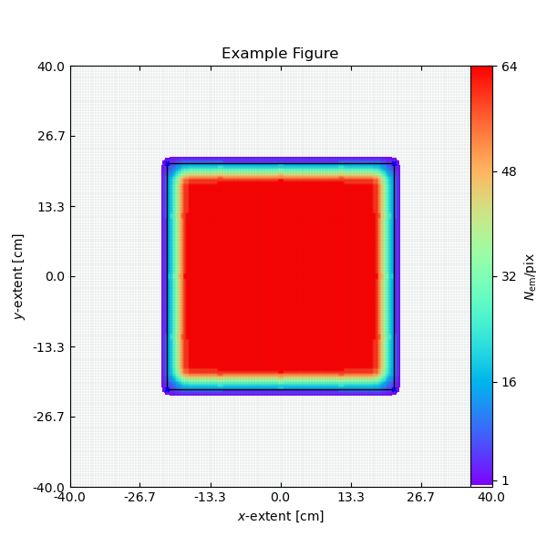
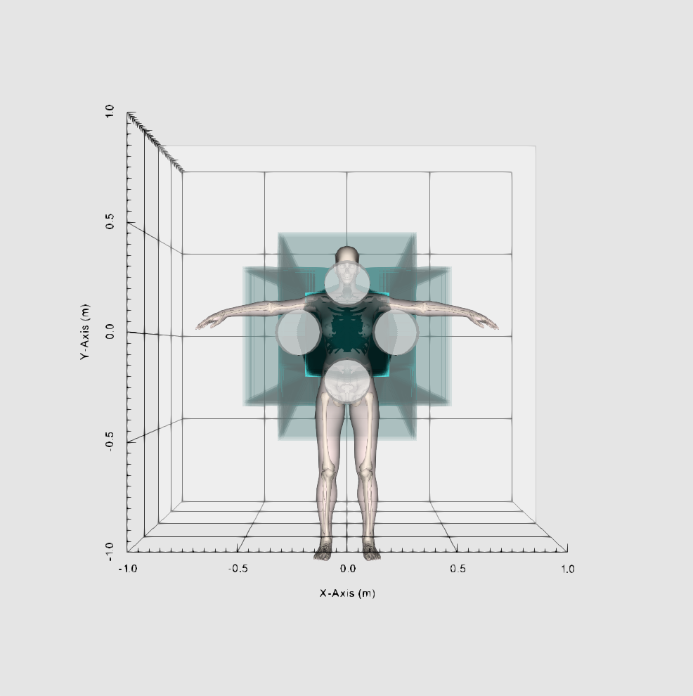

# SCIMITAR_PUBLIC


**SCIMITAR: Simulating Complete Irradiation Maps and Improving Tomosynthesis in X-ray Radiography**

This repository contains the publicly available version of the SCIMITAR software developed for the paper *SCIMITAR: Optimising chest digital tomosynthesis devices using geometric simulations and genetic algorithms* by A.D. Hill et al. 2025 (DOI 10.1088/2057-1976/ae0fa0).

## About

SCIMITAR is a Python-based simulation framework for designing and analysing chest digital tomosynthesis (DT) geometries. It models X-ray radiation coverage in multi-panel flat panel source (FPS) configurations via the intersections between distributed X-ray emitters and a detector plane. It computes irradiation maps, evaluates performance metrics, and supports 3D visualisation using VTK. The framework enables rapid exploration of large design spaces to identify configurations that balance imaging performance, engineering feasibility, and clinical requirements.

### 🚧 Repository Status

**This repository is currently under active development and is subject to change.**

### Key Features

- **Flexible DT Device Design** - Create single- or multi-panel configurations with customisable emitter grids, cone angles, panel orientations, and more.
- **Irradiation Mapping** - Compute pixel-wise irradiation distributions on user-defined intersection planes.
- **Quantitative Performance Metrics** - Quantify coverage, emitter overlap, angular range, and stray radiation extents.
- **3D Visualisation** - View panels, cones, and patient models in an interactive VTK viewer.

## 🧩 Repository Structure

| File                  | Description                                                                                               |
| --------------------- | --------------------------------------------------------------------------------------------------------- |
| `Run.py`              | Example execution script demonstrating full SCIMITAR workflow                                             |
| `SCIMITAR.py`         | Main module defining the `Scimitar` class, geometry construction, map generation, and metrics computation |
| `aux_material.py`     | Auxiliary classes and helper functions for maintaining a clean main class                                 |
| `clipping_utils.py`   | Functions for computing geometric intersections using VTK                                                 |
| `read_patient.py`     | Utilities for loading example or illustrative patient objects                                             |
| `interactor_utils.py` | VTK-based visualisation tools and scene interaction setup                                                 |

### Dependencies

Key Python packages:
``` 
Pillow==10.2.0
matplotlib==3.8.0
numpy==1.26.3
pandas==1.3.4
scipy==1.11.4
tqdm==4.65.0
vtk==9.2.6
```
### ⚙️ Installation and Example Use

Clone the repository:

```
git clone https://github.com/Alex-Hill94/SCIMITAR_PUBLIC.git
cd SCIMITAR_PUBLIC
```

The simplest way to run SCIMITAR is to execute the provided example:

```
python Run.py
```

This script builds a scene containing four panels, each containing a 4×4 grid of square-cone emitters. It generates 2D irradiation maps at detector and mid-height planes, visualises the geometry, and computes and prints performance metrics.

#### Example Output

```
Acceptable geometry, creating visualisation...
Reading SCIMITAR_PUBLIC/patient/skeletal: 100%|██████| 49/49 [00:00<00:00, 138.91it/s]
Reading SCIMITAR_PUBLIC/patient/skull: 100%|██████| 9/9 [00:00<00:00, 76.63it/s]
                               0
Cone_Angle             31.900000
SID                     0.976000
Emitter_Pitch           0.010000
Panel_Pitch             0.229000
Panel_Angle            12.500000
Angular_Range          27.329982
Illumination          100.000000
Overlap_2D             86.512980
Overlap_Mid_2D         63.912926
Overlap_3D             63.912926
Stray_Radiation       808.000000
Panel_Collision         0.000000
Panel_Xray_Collision    0.000000
Outside_Wafer           0.000000
Acceptable_Stray        1.000000
Contained_Panels        1.000000
```




#### Select Output Metrics

- Overlap_2D – Quantifies how uniformly a plane (e.g. the detector surface) is irradiated by all emitters.

- Overlap_3D – Extends the 2D metric into three dimensions by evaluating how well the irradiated volume above the detector is covered. Note - for a meaningful value, set *intersection_heights = full_intersection_heights*.

- Angular range – The maximum angular span between any pair of emitters in the configuration.

- Stray radiation – The number of detector pixels receiving irradiation outside the defined detector bounds.

### Typical Workflow

- Modify geometry parameters in Run.py (e.g., number of emitters, cone angle, or panel tilt).

- Generate irradiation maps via S.Irradiation().

- Evaluate metrics using S.Metrics().

- Visualise geometry and intersections using S.Visualise().

- Export results from the DataFrame S.df.

## Citation

If you use this software in your research, please cite both the software and the source paper:

### Software
  
  @software{hill2025scimitar_software,  
  author = {Hill, Alexander and Aflyatunova, Daliya and Holloway, Fraser},  
  title = {SCIMITAR: Publicly Available Software},  
  year = {2025},  
  publisher = {GitHub},  
  url = {https://github.com/Alex-Hill94/SCIMITAR_PUBLIC}  
  }

### Paper

  @article{hill2025scimitar,  
  title = {SCIMITAR: Optimising chest digital tomosynthesis devices using geometric simulations and genetic algorithms},  
  author = {Hill, A.D. and others},  
  journal = {TBD},  
  year = {2025},  
  note = {In press}  
  }  

Full paper reference will be added upon publication.

## Contact

For questions or inquiries about this software, please contact a.d.hill@liverpool.ac.uk.

## Acknowledgments

This work was developed in collaboration with Adaptix Ltd., pioneers in cold-cathode X-ray emitter array technology for flat panel source imaging systems.

---

